# 使用SpringBoot + Vue(若依前后端分离版) 写项目的一些总结

## 获取Redis服务

```java
@Autowired
private RedisCache redisCache;
```

```java
String captcha = redisCache.getCacheObject(verifyKey);
```

## 权限认证

```java
@Resource
private AuthenticationManager authenticationManager;

 authentication = authenticationManager
                    .authenticate(new UsernamePasswordAuthenticationToken(username, password));
```

Spring Security 拦截顺序 很重要 一旦全部拦截了,后面设置的就失效了。


## 多权限验证

由于 若依框架内置的Security 已经内置了后台的权限拦截,但是如果我们 想要自己实现自己的权限拦截,那么 其中一种方式就是自己再写一份,默认

## Spring Security 设置自定义的DetailsService和加密方法

在Spring Security 中验登录一方面可以再内存中定义用户名密码,另一方面 可以 实现一个结构 UserDetailsService 

在接口中 我们需要 通过用户名 获取到一些信息,比如账号密码 账户是否锁定等,

```java
@Service
public class MyUserDetailsServiceImpl implements UserDetailsService {
    private static final Logger log = LoggerFactory.getLogger(UserDetailsServiceImpl.class);
    //可以改为自己的用户数据库 来获取 用户名 密码
  	@Autowired
    private IWebUserinfoService webUserinfoService; 
    @Override
    public UserDetails loadUserByUsername(String username) throws UsernameNotFoundException {
        WebUserinfo webUserinfo = new WebUserinfo();
        webUserinfo.setUsername(username);
         //按用户名 从数据库中找出 用户信息
        List<WebUserinfo> res = webUserinfoService.selectWebUserinfoList(webUserinfo);
        if (res.size()==0){
            log.info("登录用户：{} 不存在.", username);
            throw new UsernameNotFoundException("登录用户：" + username + " 不存在");

        }else if(res.get(0).getIsvalid().equals(0)){
            log.info("登录用户：{} 已被停用.", username);
            throw new BaseException("对不起，您的账号：" + username + " 已停用");
        }
        return createLoginUser(res.get(0));
    }

    public UserDetails createLoginUser(WebUserinfo webUserinfo)
    {
       //返回一个 SpringSecurity 封装格式的 用户对象 包含账号 密码 是否锁定 等一系字段和方法
        MyUserDetails a = new MyUserDetails();
        a.setUsername(webUserinfo.getUsername());
        a.setPassword(webUserinfo.getPassword());
        a.setIslocked(webUserinfo.getIsvalid());
        return a;
    }
}
```

下面 就是实现了UserDetails 接口的 自定义实现,其中账号密码 必须要 其他账号是否锁定 也要是true ,权限列表,等信息 可以按照需求  当然 你也可以写死,直接return true

```java
@Component
public class MyUserDetails implements UserDetails {
    private static final long serialVersionUID = 1L;

    //登录用户名
    private String username;
    //登录密码
    private String password;

    public Integer getIslocked() {
        return islocked;
    }

    public void setIslocked(Integer islocked) {
        this.islocked = islocked;
    }

    //是否锁定
    private Integer islocked;

    //一系列权限列表
    private Collection<? extends GrantedAuthority> authorities;

    public void setUsername(String username) {
        this.username = username;
    }

    public void setPassword(String password) {
        this.password = password;
    }

    public void setAuthorities(Collection<? extends GrantedAuthority> authorities) {
        this.authorities = authorities;
    }

    @Override
    public Collection<? extends GrantedAuthority> getAuthorities() {
        return this.authorities;
    }

    @Override
    public String getPassword() {
        return this.password;
    }

    @Override
    public String getUsername() {
        return this.username;
    }
		//账号是否没过期 可写死 
    @Override
    public boolean isAccountNonExpired() {
        return true;
    }

  	//账号是否没有被 锁定 如果 false 就登录不了了
    @Override
    public boolean isAccountNonLocked() {
        if (this.islocked ==0){
            return false;
        }
        return true;
    }

    @Override
    public boolean isCredentialsNonExpired() {
        return true;
    }

    @Override
    public boolean isEnabled() {
        return true;
    }
}
```

## Spring Security 验证码拦截

1. 通过继承 GenericFilterBean 并添加到 SpringSecurity 来完成登录时,对验证码的校验,验证码 我们存在Redis中 Key 我们通过随机生成一个UUID 来指定。

2. 所以当登录请求发送时,我们会先经过拦截器,从Redis缓存中获取生成的验证码,和前端传入的验证码做比较。如果相同就放行,否则直接抛出错误。

   ```java
   @Component
   public class myvalidfilter extends GenericFilterBean {
       @Autowired
       private RedisCache redisCache;
       //请求拦截的路径
       private String defaultFilterProcessUrl = "/webapi/login";
       @Override
       public void doFilter(ServletRequest servletRequest, ServletResponse servletResponse, FilterChain filterChain) throws IOException, ServletException {
           HttpServletRequest request = (HttpServletRequest) servletRequest;
   
           HttpServletResponse response = (HttpServletResponse) servletResponse;
           if ("POST".equalsIgnoreCase(request.getMethod()) && defaultFilterProcessUrl.equals(request.getServletPath())) {
               String uuid = request.getParameter("uuid");
               String validCode = request.getParameter("validCode");
               if(StringUtils.isEmpty(validCode) ||StringUtils.isEmpty(uuid) ){
                   throw new AuthenticationServiceException("验证码不能为空!");
               }
   
               Integer validCodeStore = redisCache.getCacheObject(uuid);
               if (validCodeStore== null){
                   throw new AuthenticationServiceException("验证码不存在!");
               }
               if (!String.valueOf(validCodeStore).toLowerCase().equals(validCode.toLowerCase())) {
                   throw new AuthenticationServiceException("验证码错误!");
               }
              
           }
   
    filterChain.doFilter(request, response);
       }
   }
   ```

3. ```java
   @Override
   protected void configure(HttpSecurity httpSecurity) throws Exception {
   	..........
   	 httpSecurity.addFilterBefore(verifyCodeFilter,UsernamePasswordAuthenticationFilter.class);添加拦截器
   ......
   }
   ```

## Vue 验证 form 表单 2次密码是否一致(2次 密码相等校验)

在 data(){} 中声明 验证规则 传入 rule ,value 和 回调函数 value 就是输入框拿到的值,我们对其进行 匹配就可以了,

然后 通过回调函数 可以让我们  把错误显示出来!

```javascript
data() {
  //回调函数
  const validpas =(rule,value,callbak) =>{
      if (this.formData.validpassword !== this.formData.password) {
        callbak(new Error("2次密码输入不匹配"));
      }else{
        callbak();
      }
  }
  
  
  password: [{
            required: true,
            message: '请输入设置密码',
            trigger: 'blur'
          }],
          validpassword: [{
            required: true,
            trigger: 'blur',
            validator:validpas, //设置回调函数
          }]
```

## Spring Boot 整合 email发送

这么简单 百度下就好了,懒得写。。。

## Element Ui 导航栏实现

效果图:

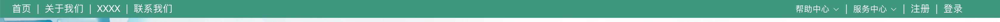


使用:elementui 偏移布局 ,element ui 下拉框, Vue Routerlink 实现

```html
  <template>
<div id="myheader" >
  <el-row>


    <el-col :span="8"><div class="grid-content bg-purple">

      <span id="firstspan"><router-link to="" tag="a">首页</router-link></span>
      <span>|</span>
      <span><router-link to="" tag="a">关于我们</router-link></span>
      <span>|</span>
      <span><router-link to="" tag="a">质朴数据库</router-link></span>
      <span>|</span>
      <span><router-link to="" tag="a">联系我们</router-link></span>

    </div>

    </el-col>


    <el-col :offset="11" :span="5"><div class="grid-content bg-purple-light">
      <el-dropdown>
      <span class="el-dropdown-link">
        帮助中心<i class="el-icon-arrow-down el-icon--right"></i>
      </span>
        <el-dropdown-menu slot="dropdown">
          <el-dropdown-item v-for="name in helplist">{{name}}</el-dropdown-item>
        </el-dropdown-menu>
      </el-dropdown>
      <span>|</span>
      <el-dropdown>
      <span class="el-dropdown-link">
        服务中心<i class="el-icon-arrow-down el-icon--right"></i>
      </span>
        <el-dropdown-menu v-for="" slot="dropdown">
          <el-dropdown-item v-for="name in servercenter" >{{name}}</el-dropdown-item>

        </el-dropdown-menu>
      </el-dropdown>
      <span>|</span>
      <span><router-link to="" tag="a">注册</router-link></span>
      <span>|</span>
      <span><router-link to="" tag="a">登录</router-link></span>


    </div></el-col>
  </el-row>
</div>
</template>

<script>
    export default {
        name: "myHeaderBar",
      methods:{

      },data(){
          return {
            helplist:["asdasd","asdasd","asdasd","asdasd","asdasd"],
            servercenter:["油条","馒头","包子","面条","睡觉"]
          }
      }
    }
</script>

<style scoped>
#myheader{
  background-color: rgb(64, 151, 128);
  height: 30px;
}
#firstspan{
  padding-left: 20px !important;
}
.el-row{
  padding-top: 5px !important;
}
span{
  padding-left: 5px !important;
  margin-top: 10px !important;
  color: white;
}

.el-dropdown-link {
  cursor: pointer;
  color: white;
}
.el-icon-arrow-down {
  font-size: 12px;
}
.el-dropdown-link:focus {
  outline: 0;
}
.el-dropdown-link {
  outline: 0;
}

</style>

```

## Vue element-ui样式冲突解决方案之一

使用element-ui 加了 scoped 会导致 覆盖默认element-ui无效,但是去除了之后,不同页面之间修改的element-ui之间可能冲突,所以解决方法是在 给 template 组件的div 加一个div或者class, 这样 访问的就是可以修改自己命名空间下的元素了。

```html
<template>
<div id="app1">
</div>
</template>

<style>
  #app1 .el-input__inner{} //对所有Css 都在 app1 下面修改
 
  </style>
```

## 树形组件的使用 vue-treeselect


设计一个多级 的文章列表

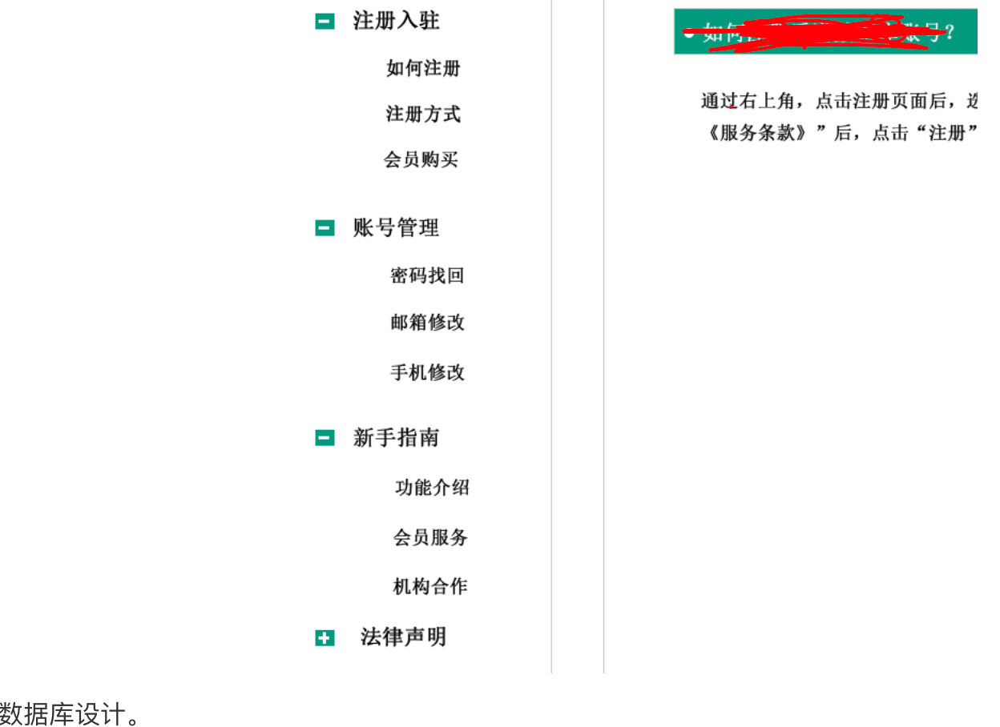

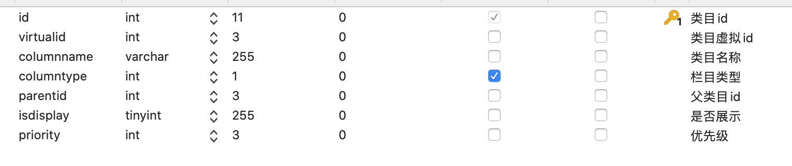

使用若依的后台生成列表代码,但是若依的后台无法生成树形控件,父类目id 需要 能动态的选择 父类目id 只能我们手动完成,还好 文档里提供了 相关的组件,

```html
//导入组件
import Treeselect from "@riophae/vue-treeselect";
import "@riophae/vue-treeselect/dist/vue-treeselect.css";
//注册组件
components: { Treeselect },
//使用组件
 <treeselect v-model="value" :multiple="true" :options="options" />
//组件的数据格式
value: null,
      // define options
      options: [ {
        id: 'a',
        label: 'a',
        children: [ {
          id: 'aa',
          label: 'aa',
        }, {
          id: 'ab',
          label: 'ab',
        } ],
      }, {
        id: 'b',
        label: 'b',
      }, {
        id: 'c',
        label: 'c',
      } ],

```

通过格式我们直到树形组件,需要的数据格式是 id 和 label 对应 我们数据库的 类目id 和 类目名称 。所以我们需要提供一个接口来查询这些数据。

数据库设计,虚拟id 是为了 可以新建一个栏目的时候直接 可以把它写成原来栏目的 id 这样直接可以起到替换栏目的作用。

```sql
/*
 Navicat Premium Data Transfer

 Source Server         : 127.0.0.1
 Source Server Type    : MySQL
 Source Server Version : 80018
 Source Host           : localhost:3306
 Source Schema         : vxhdb

 Target Server Type    : MySQL
 Target Server Version : 80018
 File Encoding         : 65001

 Date: 19/05/2020 11:15:50
*/

SET NAMES utf8mb4;
SET FOREIGN_KEY_CHECKS = 0;

-- ----------------------------
-- Table structure for web_articlecolumn
-- ----------------------------
DROP TABLE IF EXISTS `web_articlecolumn`;
CREATE TABLE `web_articlecolumn` (
  `id` int(11) NOT NULL AUTO_INCREMENT COMMENT '类目id',
  `virtualid` int(3) DEFAULT NULL COMMENT '类目虚拟id',
  `columnname` varchar(255) COLLATE utf8mb4_general_ci DEFAULT NULL COMMENT '类目名称',
  `columntype` int(1) NOT NULL COMMENT '栏目类型',
  `parentid` int(3) DEFAULT '-1' COMMENT '父类目id',
  `isdisplay` tinyint(255) DEFAULT NULL COMMENT '是否展示',
  `priority` int(3) DEFAULT NULL COMMENT '优先级',
  PRIMARY KEY (`id`)
) ENGINE=InnoDB AUTO_INCREMENT=10 DEFAULT CHARSET=utf8mb4 COLLATE=utf8mb4_general_ci;

-- ----------------------------
-- Records of web_articlecolumn
-- ----------------------------
BEGIN;
INSERT INTO `web_articlecolumn` VALUES (1, -1, '顶级栏目', 0, -1, 1, 0);
INSERT INTO `web_articlecolumn` VALUES (2, -1, '顶级栏目1', 0, -1, 1, 0);
INSERT INTO `web_articlecolumn` VALUES (3, -1, '顶级栏目2', 0, -1, 1, 0);
INSERT INTO `web_articlecolumn` VALUES (4, -1, '顶级栏目3', 0, -1, 1, 0);
INSERT INTO `web_articlecolumn` VALUES (5, -1, '子栏目1', 1, 2, 1, 0);
INSERT INTO `web_articlecolumn` VALUES (6, -1, '子栏目2', 1, 3, 1, 0);
INSERT INTO `web_articlecolumn` VALUES (7, -1, '子栏目3', 1, 1, 1, 0);
INSERT INTO `web_articlecolumn` VALUES (8, -1, '孙子栏目1', 2, 5, 1, 0);
INSERT INTO `web_articlecolumn` VALUES (9, -1, '孙子栏目2', 2, 6, 1, 0);
COMMIT;

SET FOREIGN_KEY_CHECKS = 1;

```


我们 按照在后端前端vue-treeselect 对数据进行封装下,新建一个 实例Bean

```javascript
package com.ruoyi.project.myweb.domain;

/**
 * Created by caomaoboy 2020-05-19
 **/
public class treeSelectBean {
    public String id ;
    public String label;

    @Override
    public String toString() {
        return "treeSelectBean{" +
                "id='" + id + '\'' +
                ", label='" + label + '\'' +
                ", children=" + children +
                '}';
    }

    public String getId() {
        return id;
    }

    public void setId(String id) {
        this.id = id;
    }

    public String getLabel() {
        return label;
    }

    public void setLabel(String label) {
        this.label = label;
    }

    public treeSelectBean getChildren() {
        return children;
    }

    public void setChildren(treeSelectBean children) {
        this.children = children;
    }

    public treeSelectBean children;

}
```


好了 我们要返回前端这种分格的数据,写几个for 循环拼装下数据,很简单。

```java
    /**
     * 获取数据库树形分页
     */
    @PreAuthorize("@ss.hasPermi('myweb:articlecolumn:query')")
    @GetMapping("/getParentIds")
    public AjaxResult getParentQuery()
    {
        //查询所有数据
        WebArticlecolumn  query = new WebArticlecolumn();
        //所有栏目
        List<WebArticlecolumn> webArticlecolumns = webArticlecolumnService.selectWebArticlecolumnList(query);
        List<treeSelectBean> mytreeSelectBean = new ArrayList<treeSelectBean>();
        for (WebArticlecolumn articlecolumn :webArticlecolumns) {
            treeSelectBean a = new treeSelectBean();
            //不是子目录
            if (articlecolumn.getIsdisplay() ==1 && articlecolumn.getColumntype() == 0){
                //设置了 虚拟id
                if (articlecolumn.getVirtualid()!= -1){
                    a.setId(articlecolumn.getVirtualid());
                }else{
                    a.setId(Math.toIntExact(articlecolumn.getId()));
                }
                a.setLabel(articlecolumn.getColumnname());
                a.setChildren(new ArrayList<treeSelectBean>());
                //把一级目录添加
                mytreeSelectBean.add(a);
            }

        }

        for (WebArticlecolumn articlecolumn :webArticlecolumns) {
            //二级目录
            if (articlecolumn.getIsdisplay() == 1 && articlecolumn.getColumntype() == 1){
                //查找对应的上级目录
                for(treeSelectBean sarticlecolumn:mytreeSelectBean){
                        if (articlecolumn.getParentid().equals(sarticlecolumn.getId())){

                            treeSelectBean a = new treeSelectBean();
                            if (articlecolumn.getVirtualid() != -1){
                                a.setId(articlecolumn.getVirtualid());
                            }else{
                                a.setId(Math.toIntExact(articlecolumn.getId()));
                            }
                            a.setChildren(new ArrayList<treeSelectBean>());
                            a.setLabel(articlecolumn.getColumnname());
                            sarticlecolumn.getChildren().add(a);
                        }
                 }


            }
        }

        for (WebArticlecolumn articlecolumn :webArticlecolumns) {
            //二级目录
            if (articlecolumn.getIsdisplay() == 1 && articlecolumn.getColumntype() == 2){
                //查找对应的上级目录
                for(treeSelectBean sarticlecolumn:mytreeSelectBean){
                    for (treeSelectBean sarticlecolumn1 :sarticlecolumn.getChildren()){
                        if (sarticlecolumn1.getChildren()!= null && articlecolumn.getParentid().equals(sarticlecolumn1.getId())){
                            treeSelectBean a = new treeSelectBean();
                            if (articlecolumn.getVirtualid() != -1){
                                a.setId(articlecolumn.getVirtualid());
                            }else{
                                a.setId(Math.toIntExact(articlecolumn.getId()));
                            }
                            a.setLabel(articlecolumn.getColumnname());
                            sarticlecolumn1.getChildren().add(a);
                        }
                    }

                }

            }
        }
        return AjaxResult.success(mytreeSelectBean);
    }
```

用一些虚假的数据做测试,数据返回成功!

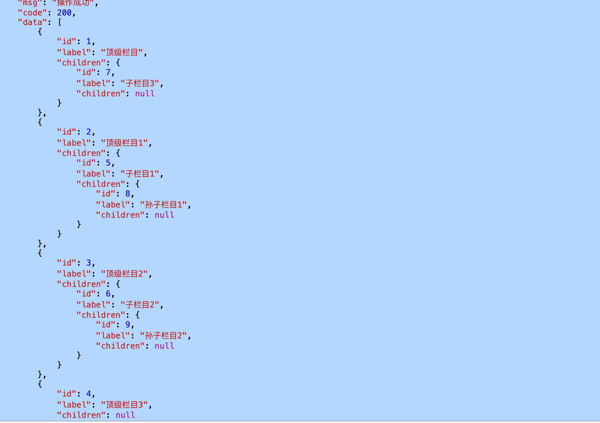

实际上 VueTreeselect 提供了 转换的方法 但是 他需要的是children的id 而我的表 设计成了指向parentid 所以没有办法只能自己实现。

```javascript
//后台返回的数据如果和VueTreeselect要求的数据结构不同，需要进行转换
normalizer(node){
  ``//去掉children=[]的children属性
  ``if``(node.children && !node.children.length){
    ``delete` `node.children;
  ``}
  ``return` `{
    ``id: node.id,
    ``label:node.name,
    ``children:node.children
  ``}
}
```

## Vue Editor使用

```css
//1.导入Editor 组件
import Editor from '@/components/Editor';

//2.注册组件
  components: {
        Editor
  },

//3.使用组件
 <el-col id="articlep" :span="24">
          <el-form-item label="文章内容" prop="columncontent">
            <!--          <el-input v-model="form.columncontent" type="textarea" placeholder="请输入内容" />-->
            <Editor v-model="form.columncontent" />
</el-form-item>
           </el-col>

//4.对 editor 的高度 和 宽度调整相关css 和一些 优化css样式
  #articlep .ql-clipboard {
    position: fixed;
    display: none;
    left: 50%;
    top: 50%;
  }
  #articlep .ql-container {
    box-sizing: border-box;
    font-family: Helvetica, Arial, sans-serif;
    font-size: 16px;
    height: 200%; //高度
    margin: 0px;
    overflow-y: hidden;
    position: relative;
  }

  #articlep .ql-editor {
    box-sizing: border-box;
    line-height: 1.42;
    height: 95%;
    outline: none;
    overflow-y: scroll;
    padding: 0px 15px;
    tab-size: 4;
    -moz-tab-size: 4;
    text-align: left;
    white-space: pre-wrap;
    word-wrap: break-word;
  }


```


## Vue实现折叠多级菜单


效果图:

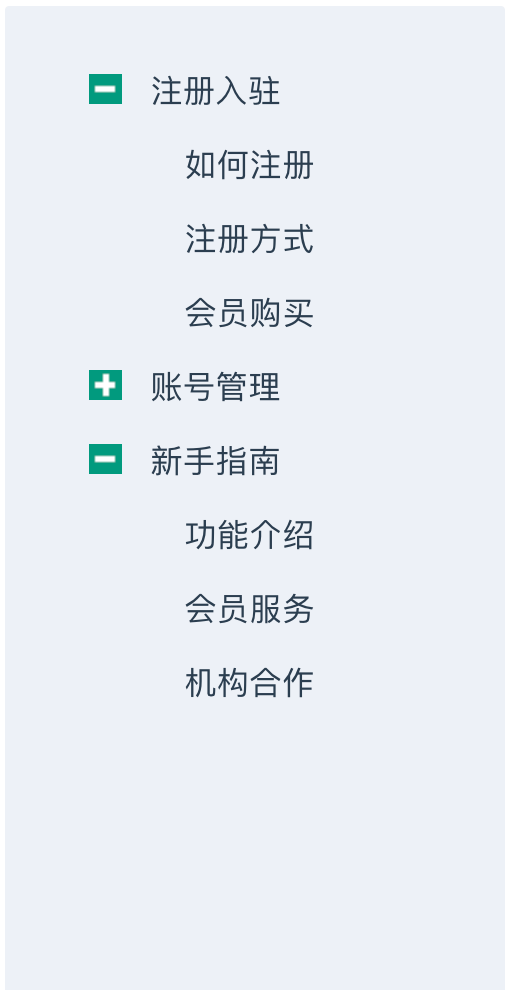


使用了 父子 li 之间之间交互使用VueBus。 

```html
<template>
  <li class="articlels">
    <div style="width: 80%;" @click="toggle()">
      <i  v-if='isFolder' class="iconfont" :class="[open?'icon-sub':'icon-add']"> &nbsp;&nbsp;&nbsp;&nbsp;</i>
      <i v-else-if='isFolder' class="iconfont icon-add">&nbsp;&nbsp;&nbsp;&nbsp;</i>
      <span  class="articellistspan" @click="sendChildVal(model)">
    {{model.nodeName}}
   </span>
    </div>
    <ul v-show="open" v-if='isFolder'>
      <p-tree v-for='(cel, index) in model.child' :model='cel' :key="index"></p-tree>
    </ul>
  </li>

</template>

<script>
    export default {
      name: "pTree",
      props: ['model', 'treeVal'],
      components: {},
      data() {
        return {
            open: true,
        }

      },computed: {
        isFolder() {
          return this.model.child && this.model.child.length
        }
      },
      methods: {
        toggle() {
          console.log("xxxx",open);
          if (this.isFolder) {
            this.open = !this.open;
          }
        },
        sendChildVal(model){
          this.bus.$emit('treeVal', model)
        }
      }
    }
</script>

<style scoped>
  ul{list-style:none;padding-left: 30px;}
  li{padding-left:18px;
    list-style:none;
  }
  .iconfont{
    padding-top: 4px;
    height: 35px;
    width: 30px !important;
    padding-bottom: 10px;
    margin-right: 10px;
  }
  .articlels{
    cursor: pointer;
    width: 150px;
  }
  .icon-add{

    background:url("../../assets/myweb/add.png") no-repeat left 5px;
  }
  .icon-sub{

    background:url("../../assets/myweb/sub.png") no-repeat left 5px;
  }
  .articellistspan{

    white-space:nowrap;
    word-break:keep-all;
    overflow:hidden;
    text-overflow:ellipsis;
    line-height: 37px;
    margin-top: 5px;

  }
</style>
```

```html
<template>
  <div id="ptreelist">
  <ul v-for="(item, index) in dataList " :key="index">
    <pTree :model='item'></pTree>
  </ul>
  </div>
</template>

<script>
    import pTree from "./pTree.vue"
    export default {
      name: "pTreeList",
      props:['dataList'],
      data() {
        return {
          ptreeVal: {},
        }
      },
      mounted() {
        this.bus.$on('treeVal', val => {//通过$on监听事件treeVal
          console.log(val.id);
          this.ptreeVal = val.id
        })
      },
      components:{
          pTree,
      }
    }
</script>

<style scoped>
  ul{
    padding-left: 0;
  }
  #ptreelist{
    width: 200px;
    padding: 0px;
  }
</style>
```

```html
//引入组件
<ul class="tree-list">
  <pTreeList :dataList="dataList" ></pTreeList>
</ul>
//数据格式
...
        return {
            dataList:[{
              nodeName: "注册入驻",
              id:'9',
              child: [{
                nodeName: '如何注册',
                id:'8',
              },{
                nodeName: '注册方式',
                id:'7',
              },{
                nodeName: '会员购买',
                id:'6',
              }]
            },
              {
                nodeName: "账号管理",
                child: [{
                  nodeName: '密码找回',
                  id:'3',
                },{
                  nodeName: '邮箱修改',
                  id:'3',
                },{
                  nodeName: '手机修改',
                  id:'3',
                }]
              },{
                nodeName: "新手指南",
                child: [{
                  nodeName: '功能介绍',
                  id:'3',
                },{
                  nodeName: '会员服务',
                  id:'3',
                },{
                  nodeName: '机构合作',
                  id:'3',
                }]
              }
            ]

          }
...
```


## Element-ui 导航栏 结合 实现局部刷新

开发中常常需要,导航栏 点击然后 点击实现 中间部分内容发生局部刷而不发生全部跳转,这样可以加速网页的渲染,

这里我们以 element的 el-menu 为例子, 以经典的三栏布局为例子,

```html
<el-container>
  <el-header>Header</el-header>
  <el-main>Main</el-main>
  <el-footer>Footer</el-footer>
</el-container>
```

我们需要把 导航栏放在顶部,如果 点击el-header内的 el-menu 导航菜单

```html
<el-menu :default-active="activeIndex" class="el-menu-demo" mode="horizontal" @select="handleSelect">
  <el-menu-item index="1">处理中心</el-menu-item>
  <el-submenu index="2">
    <template slot="title">我的工作台</template>
    <el-menu-item index="2-1">选项1</el-menu-item>
    <el-menu-item index="2-2">选项2</el-menu-item>
    <el-menu-item index="2-3">选项3</el-menu-item>
    <el-submenu index="2-4">
      <template slot="title">选项4</template>
      <el-menu-item index="2-4-1">选项1</el-menu-item>
      <el-menu-item index="2-4-2">选项2</el-menu-item>
      <el-menu-item index="2-4-3">选项3</el-menu-item>
    </el-submenu>
  </el-submenu>
  <el-menu-item index="3" disabled>消息中心</el-menu-item>
  <el-menu-item index="4"><a href="https://www.ele.me" target="_blank">订单管理</a></el-menu-item>
</el-menu>
```


  el-main 的主题内容实现路由的局部刷新。

要实现 这个 功能 我们

1. 首先 要在 el-menu 加上 router 这个标签

2. 然后index  就可以设置为要跳转的 路由了

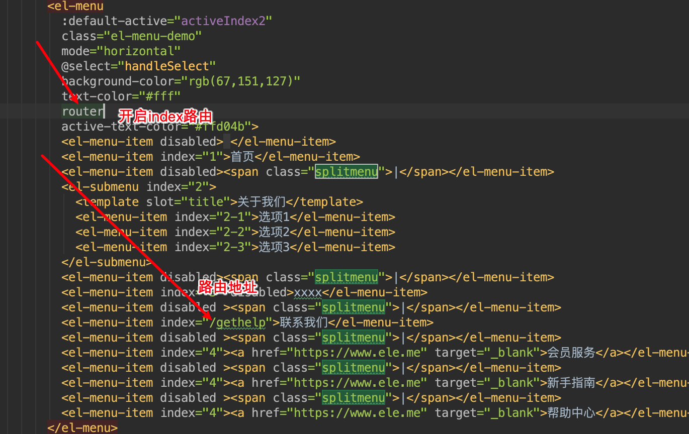

3. 最后 我们还需要取设置路由,在当前路由下设置children 路由

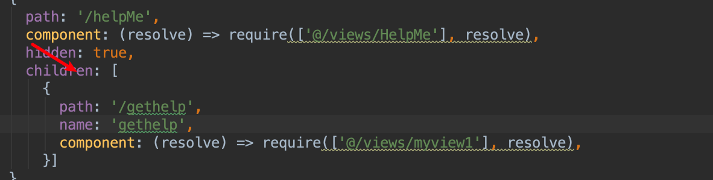


##  实现vue + el-menu记录导航栏激活状态的变化


```html
:default-active="this.$route.path"//在 el-menu中 加上这句标签
```


## vue 多选框省市区 

1. `provinceAndCityData`是省市二级联动数据（不带“全部”选项）
2. `regionData`是省市区三级联动数据（不带“全部”选项）
3. `provinceAndCityDataPlus`是省市区三级联动数据（带“全部”选项）
4. `regionDataPlus`是省市区三级联动数据（带“全部”选项）
5. "全部"选项绑定的value是空字符串`""`
6. `CodeToText`是个大对象，属性是区域码，属性值是汉字 用法例如：`CodeToText['110000']`输出`北京市`
7. `TextToCode`是个大对象，属性是汉字，属性值是区域码 用法例如：`TextToCode['北京市'].code`输出`110000`,`TextToCode['北京市']['市辖区'].code`输出`110100`,`TextToCode['北京市']['市辖区']['朝阳区'].code`输出`110105`


> 1.npm install element-china-area-data -S //安装
>
> **2.import** { provinceAndCityData, regionData, provinceAndCityDataPlus, regionDataPlus, CodeToText, TextToCode } **from** 'element-china-area-data' //导入


##  Vue + Springboot 使用支付宝支付

支付宝 首先我们 先得。。。

懒得写 。。。。

## 图片上传

上传图片 我们使用upload组件,若依提供了一个通用的端口可以上传文件。


```html
     
<el-upload
            class="upload-demo"
            :action="upload"//上传的url
            :on-preview="handlePreview" //上传前的毁掉方法
            :on-remove="handleRemove" //删除上传的毁掉方法
            :file-list="fileList" 	//文件列表
                       :limit="1" //只能上传一个限制
            list-type="picture"> //上传文件类型
            <el-button size="small" type="primary">点击上传</el-button>
            <div slot="tip" class="el-upload__tip">只能上传jpg/png文件，且不超过500kb</div>
          </el-upload>

data(){
return {
  fileList: [],
  upload:`${process.env.VUE_APP_BASE_API}/common/upload`
  .....
  }}
```

效果：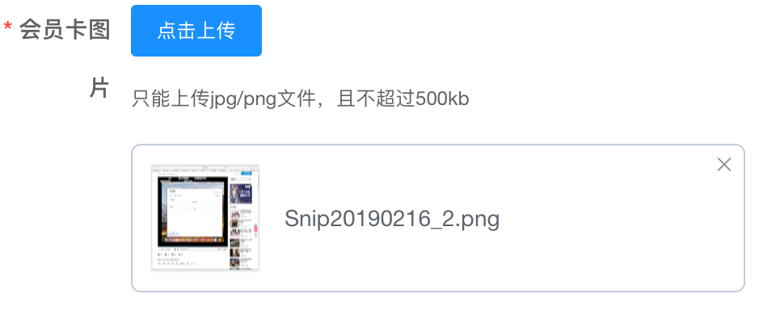

即使设置好了,实际上我们也是没法上传上取得,因为 如果直接通过url 请求去上传文件,权限系统会拦截不带token的请求,所以我们需要 在上传时附带上token.

好在 el-element 提供了 一个回调接口可以让放入自定义请求参数。

:headers 可以手动添加 我们想要传入的 头,Toekn一般是不变的 我们用计算属性 来获取token,注意计算属性最好放在data前面

```
computed:{
  headers(){
    return {
      Authorization: `Bearer ${getToken()}`
    }
  }
}
```

```html
<el-upload
  class="upload-demo"
  :action="upload"
  :on-preview="handlePreview"
  :on-remove="handleRemove"
  :headers="headers" //将token传入
  :limit="1"
  :file-list="fileList"
  list-type="picture">
  <el-button size="small" type="primary">点击上传</el-button>
  <div slot="tip" class="el-upload__tip">只能上传jpg/png文件，且不超过500kb</div>
</el-upload>
```

接下来 我们就可以成功的上传图片了。

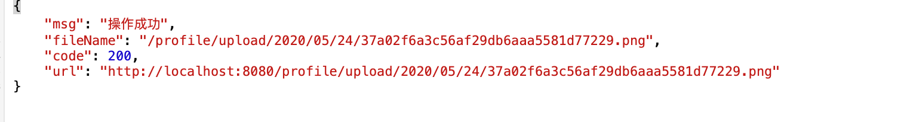

当然 上传完图片 我们要处理 得到url 然后把它 设置到form 中去,这样提交后才能保存。为此 我们需要 给上传成功

绑定一个毁掉方法 :on-success="handleSuccess" 在method中创建一个这样的方法。

```javascript
handleSuccess(res, file){
  this.form.vipcardimg = res.fileName; //把上传成功后的url 给到 要提交的表单
}
```

#### 图片上传组件的回显

当我们点击修改按钮时,图片需要回显 我们只需要把 图片框绑定的 fileList 里面添加一个对象 包含url和 name 即可。

```javascript
 let a = {name: this.form.vipcardimg, url: `${process.env.VUE_APP_BASE_API}${this.form.vipcardimg}`
this.fileList.push(a);
```

可以将上面内容添加到点击编辑的时候.


## 若依SpringBoot Vue 设置多Token函数


```
import Cookies from 'js-cookie'

const TokenKey = 'Admin-Token'

export function getToken() {
  return Cookies.get(TokenKey)
}

export function setToken(token) {
  return Cookies.set(TokenKey, token)
}

export function removeToken() {
  return Cookies.remove(TokenKey)
}

//这里我由前台系统就 再把上面的复制一份 用来存放获取token
const UserTokenKey = 'User-Token'

export function getUserToken() {
  return Cookies.get(UserTokenKey)
}

export function setUserToken(token) {
  return Cookies.set(UserTokenKey, token)
}

export function removeUserToken() {
  return Cookies.remove(UserTokenKey)
}

```

 

##  Vue axios请求拦截器 

在若依的 utils 的 request.js 文件下,可以修改 访问权限。比如 你有前后台 如果 你想让前台访问的时候带前台的token 后台访问的售后带上 后台的token 如果用前端控制,那么 你就在 拦截器里面加上 前端访问的路径,做下 if判断。

```html
// request拦截器
service.interceptors.request.use(
//由于 我的项目有前台和后台如果同时登陆 会有2个token 所以 传token时  需要进行判断
if (config.url != '/login') {
    config.headers['Authorization'] = getToken()
 }
```


## Element-ui Vue 实现列表 展示图片和缩略图

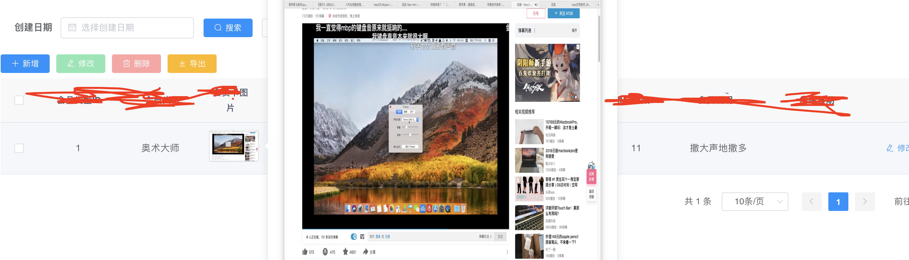

有的时候我们上传了图片但是像让它,但是只有url 显示不够直观,所以 就要动手改造 把url 改造成显示图片其实方法比较简单,直接复制 下 就可以 然后把里面的字段改成你的 表字段名。

```html
<el-table-column align="center" width="80" prop="改字段名" label="会员卡图片">
  <template scope="scope">
    <el-popover placement="right" title="" trigger="hover">
      
      
    </el-popover>
  </template>
</el-table-column>
```


## Element-ui 列宽度超出 省略号


效果图：

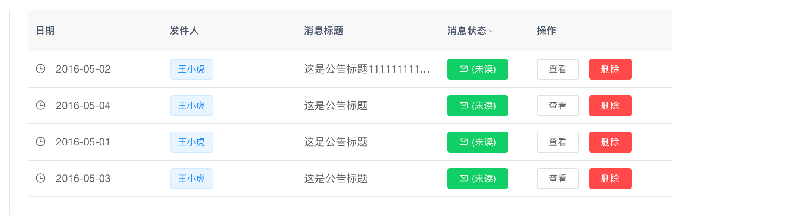

```html
<el-table-column
  :show-overflow-tooltip="true"
  prop="title"
  label="消息标题">
</el-table-column>
```


## 一个较为简单的站内信息表设计

 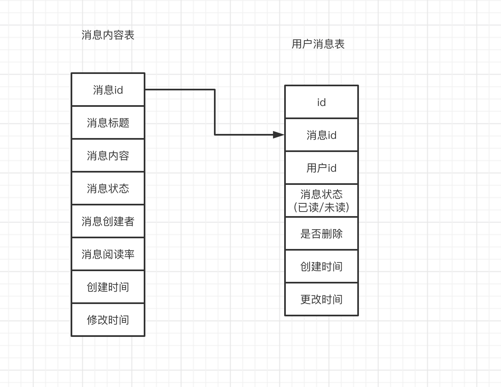


我们 需要创建 2张表 一张用来存放消息,一张用来存放 消息 和用户之间的关系。当我们通过后台发送消息时，

就循环遍历所有用户给每个用户写入一条消息记录。


## SpringBoot Security 获取当前的 用户session信息

```java
LoginUser user = (LoginUser) SecurityContextHolder.getContext().getAuthentication().getPrincipal();
```

## MyBatis 插入数据返回主键id

```
<insert id="insertWebMsgstore" useGeneratedKeys="true"  keyProperty="id"  
......
```

把 useGeneratedKeys 设置为true keyProperty设置为插入后根新的id字段,然后 插入后就能从bean中获取。


## 时间日期格式转换

在mybatis 中通过arraylist 查出的时间 2020-05-26T11:05:22.000+0800 格式不符合我们想要的,故用js 对其进行格式化。

```javascript
myTime(date){
  var arr=date.split("T");
  var d=arr[0];
  var darr = d.split('-');

  var t=arr[1];
  var tarr = t.split('.000');
  var marr = tarr[0].split(':');

  var dd = parseInt(darr[0])+"/"+parseInt(darr[1])+"/"+parseInt(darr[2])+" "+parseInt(marr[0])+":"+parseInt(marr[1])+":"+parseInt(marr[2]);
  return this.formatDateTime(dd);
},addZero(num) {
  return num < 10 ? '0' + num : num;
},formatDateTime (date) {
  var time = new Date(Date.parse(date));
  time.setTime(time.setHours(time.getHours() + 8));
  var Y = time.getFullYear() + '-';
  var  M = this.addZero(time.getMonth() + 1) + '-';
  var D = this.addZero(time.getDate()) + ' ';
  var h = this.addZero(time.getHours()) + ':';
  var m = this.addZero(time.getMinutes()) + ':';
  var  s = this.addZero(time.getSeconds());
  return Y + M + D + h + m + s ;
  // }
}
```

直接在vue中使用

```
{{  myTime(scope.row.createdate) }}
```

效果

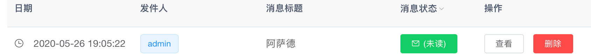


## Vue 修改树形 表格的图标

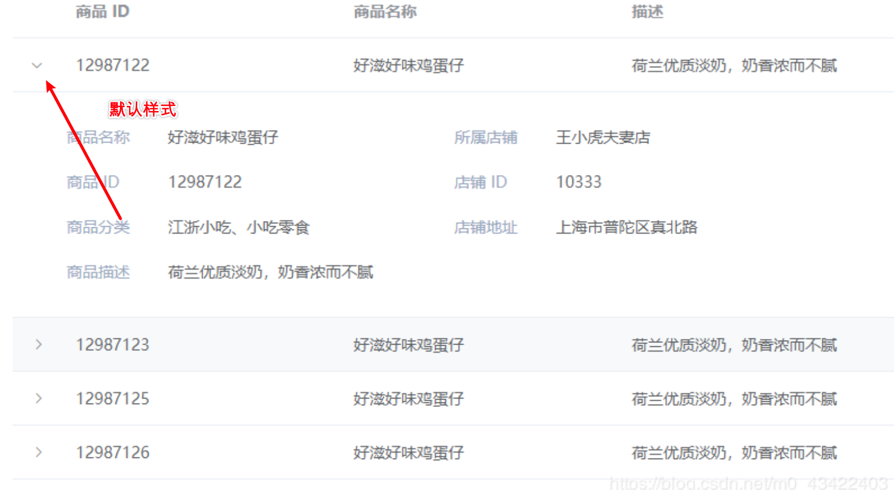


1. 我们想要修改成自定义的图标,首先要把原有的样式 清除。

```css
.el-table__expand-column .cell {
  display: none !important;
}
```

好了,此时前面应该没有 > 符号了,这样你也点不了了。

2 . 我们 添加一列 来放置按钮 从而实现 点击下拉表格,当然 你也可以 不单独 添加一列直接绑定在表的第一个字段里。

```css
<el-table-column width="10px" >
  <template slot-scope="scope">
    <i v-show = "!scope.row.expansion" class="iconfont icon-zhankai" @click="expend(scope.row)"></i>
    <i v-show = "scope.row.expansion" class="iconfont icon-shouqi" @click="expend(scope.row)" ></i>
  </template>
</el-table-column>
     
```

3. 我们定义样式:

```css
.icon-zhankai{
  content: url("../assets/myweb/add.png");//展开图标,换成自己的
}

.icon-shouqi{
  content: url("../assets/myweb/sub.png"); //收回图标,换成自己的

}
```


好了 我们 为了我们能取到表格数据,我们需要在 表格的 属性上加上 ref="table" ,

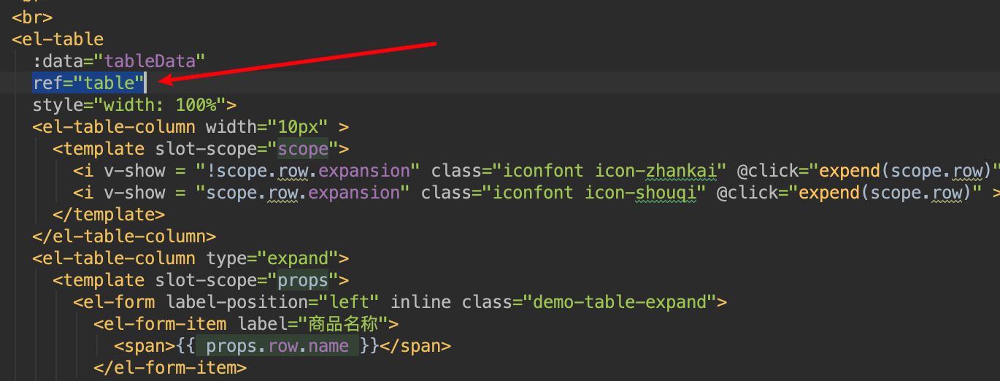


4. 加下来 我们需要用到 点击绑定的函数 expend 

```javascript
expend(row){
  let $table = this.$refs.table;
  //匹配所有 行 如果 和当前点击行的id相同 则取反 否则 把原先展开的那行关闭
  this.tableData.map((item) => {
    if (row.id != item.id) {
      $table.toggleRowExpansion(item, false)
      item.expansion = false
    }
    else{
      item.expansion = !item.expansion
    }
  })
  $table.toggleRowExpansion(row);
},
```

好了 完成上面4步就算Ok了!

##### 效果图

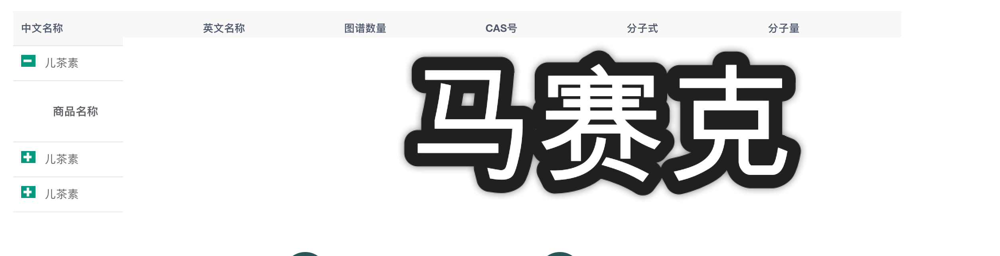


## element-ui table 下拉表格 点击某行 添加样式

我们要实现  点击表格能展开 并且 点击后 要把 点击行的 底部边框隐藏。

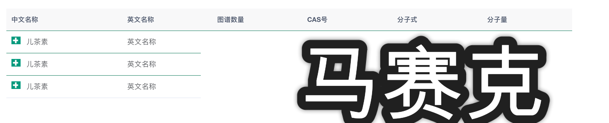

点击后 效果

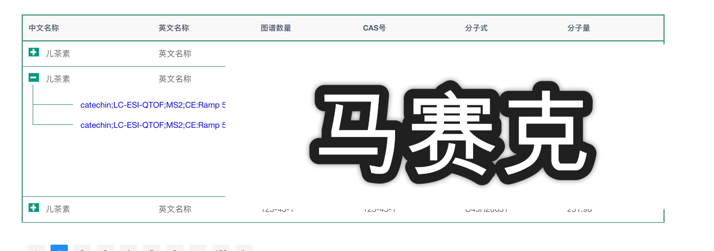

 点击后 我们要对 底部边框进行消除,  我们可以使用 el-table 自带的 点击事件

```html
@row-click="rowClick" //行点击时间
:row-class-name="tableRowClassName" //可以设置每一行对应的样式
:row-style="selectedHighlight" //返回对应的样式
```


```javascript
tableRowClassName ({row, rowIndex}) {
  //把每一行的索引放进row
  row.index = rowIndex;
},
selectedHighlight({row, rowIndex}) {
  console.log(this.getIndex,"row",row,"rowindex",rowIndex);
  if ((this.getIndex) === rowIndex ) { 
    return {
      "border":"0px" //点击后 对行的边框进行隐藏
    }

  }
},
rowClick (row) {
  this.getIndex=row.index//我们需要在data 里面 存放一个getIndex变量来记录 点击的行的索引
}
```


注意 我们要多表格底部样式 进行修改,使tr 边框能显示出来,并且把 td的下边框去除。

```css
.el-table,table{
  border-collapse: collapse !important;
}
//消除td底部边框
.el-table  th.is-leaf, .el-table td{
    border:0px;
  }
//使用tr底部边框
.el-table tr{
    border-bottom:1px solid rgb(67,151,127) ;
  }
```

